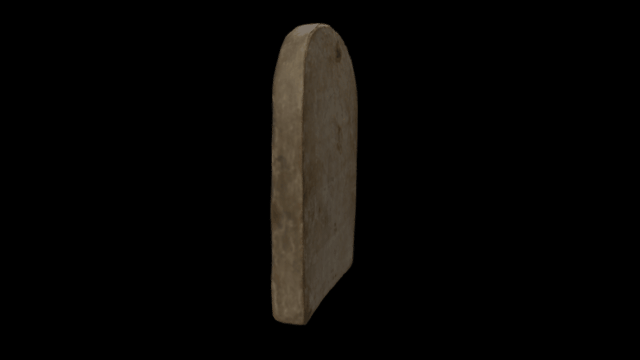

# A 3D model of the stela of Denieunkhonsu AncientLives

3D data for recreation of a British Museum object.

Wooden funerary stela of Deniuenkhons: Deniuenkhons wears a long, full wig embellished with a floral fillet, a perfume cone, and lotuses.

COL: http://www.britishmuseum.org/research/collection_online/collection_object_details.aspx?partId=1&objectId=117434

Height: 33 centimetres Width: 27 centimetres Thickness: 4 centimetres Weight: 1.302 kilograms

# LICENSE
The contents of this repository are licensed under CC-BY-NC-SA

# Credits
Photographs and models by Daniel Pett <dpett@britishmuseum.org>, Digital Humanities Lead, British Museum

Copyright Trustees of the British Museum
